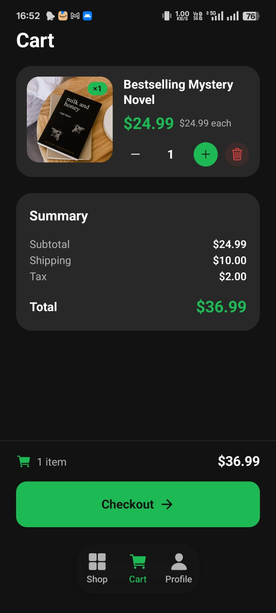
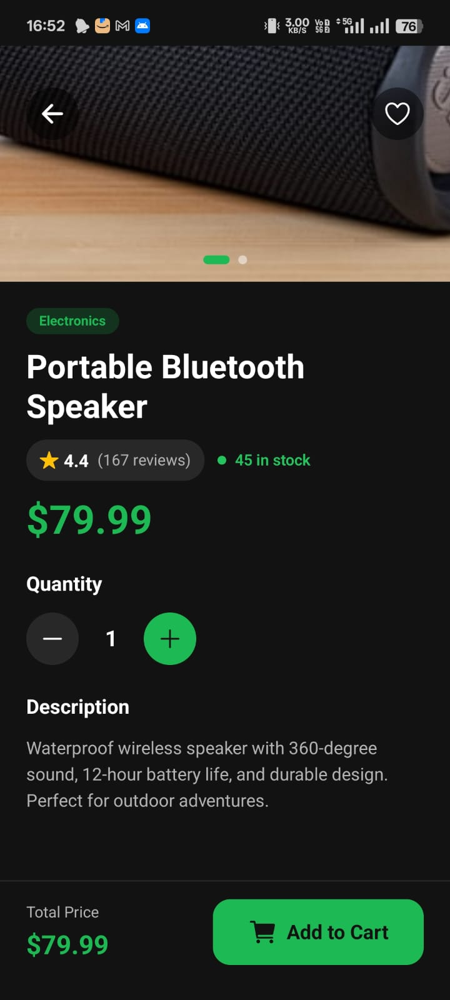
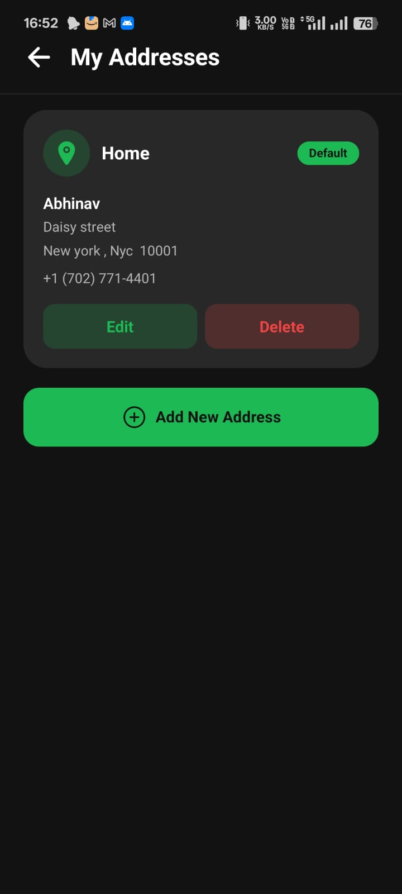
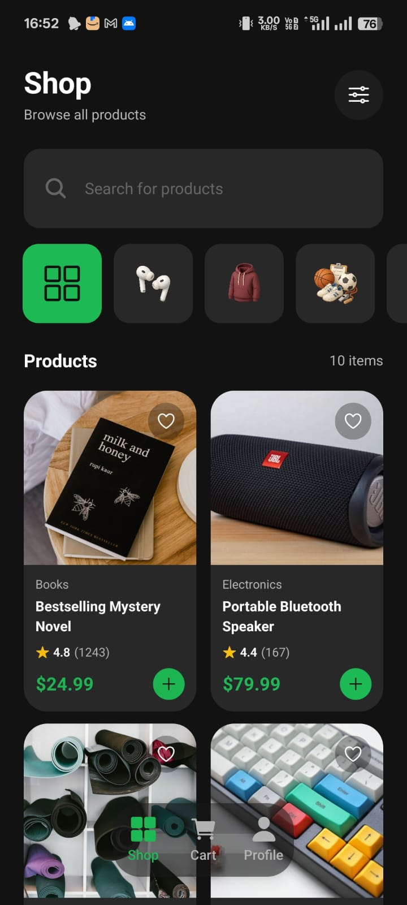
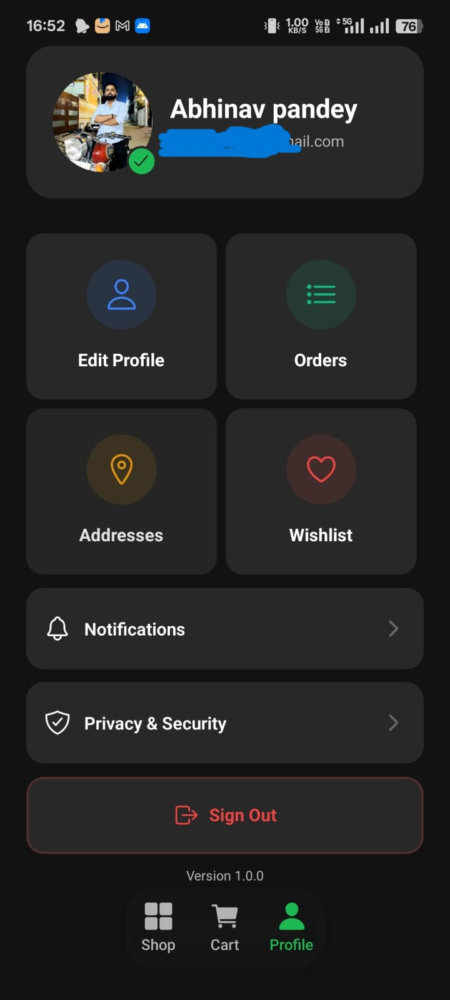

# 🛍️ EXPO E-Commerce Platform

A full-stack e-commerce solution featuring a React Native mobile app, Node.js backend API, and React admin dashboard.

## ✨ Features

### Mobile App
- 📱 **React Native + Expo** — Cross-platform mobile app
- 🔐 **Secure Authentication** — Clerk integration with Google & Apple sign-in
- 🛒 **Shopping Features** — Cart, favorites, wishlist, and checkout flow
- 💳 **Stripe Payments** — Secure payment processing
- 🗺️ **Address Management** — Multiple address support
- 🏠 **Product Catalog** — Browse and search products
- ⭐ **Ratings & Reviews** — Customer feedback system
- 🖼️ **Image Slider** — Beautiful product image gallery

### Admin Dashboard
- 🏪 **Dashboard** — Live analytics and key metrics
- 📦 **Product Management** — CRUD operations with image handling
- 📋 **Order Management** — Track and manage orders
- 👥 **Customer Management** — View customer details and activity
- 🔒 **Admin-Only Routes** — Protected admin access

### Backend API
- ⚙️ **Node.js + Express** — RESTful API with authentication
- 🛂 **Role-Based Access** — Admin and user roles
- 📦 **Background Jobs** — Inngest for async operations
- 🛡️ **Error Monitoring** — Sentry integration
- 🔐 **Secure** — Authentication middleware and authorization

### DevOps & Deployment
- 🚀 **Deployed on Sevalla** — Production-ready
- 📊 **TanStack Query** — Data fetching and caching
- 🧰 **Git & GitHub Workflow** — Proper branching and PR process
- 🤖 **CodeRabbit Analysis** — Automated code reviews

## 🗂️ Project Structure

```
├── admin/          # React admin dashboard
├── backend/        # Node.js + Express API
├── mobile/         # React Native + Expo app
└── README.md       # This file
```

## 🚀 Getting Started

### Prerequisites
- Node.js (v14 or higher)
- npm or yarn
- Expo CLI (for mobile development)

### Installation & Setup

#### 1. Backend Setup
```bash
cd backend
npm install
```

Create a `.env` file:
```env
NODE_ENV=development
PORT=3000
DB_URL=<YOUR_DB_URL>
CLERK_PUBLISHABLE_KEY=<YOUR_CLERK_PUBLISHABLE_KEY>
CLERK_SECRET_KEY=<YOUR_CLERK_SECRET_KEY>
INNGEST_SIGNING_KEY=<YOUR_INNGEST_SIGNING_KEY>
CLOUDINARY_API_KEY=<YOUR_CLOUDINARY_API_KEY>
CLOUDINARY_API_SECRET=<YOUR_CLOUDINARY_API_SECRET>
CLOUDINARY_CLOUD_NAME=<YOUR_CLOUDINARY_CLOUD_NAME>
ADMIN_EMAIL=<YOUR_ADMIN_EMAIL>
CLIENT_URL=http://localhost:5173
STRIPE_PUBLISHABLE_KEY=<YOUR_STRIPE_PUBLISHABLE_KEY>
STRIPE_SECRET_KEY=<YOUR_STRIPE_SECRET_KEY>
STRIPE_WEBHOOK_SECRET=<YOUR_STRIPE_WEBHOOK_SECRET>
```

Run the backend:
```bash
npm run dev
```

#### 2. Admin Dashboard Setup
```bash
cd admin
npm install
```

Create a `.env` file:
```env
VITE_CLERK_PUBLISHABLE_KEY=<YOUR_CLERK_PUBLISHABLE_KEY>
VITE_API_URL=http://localhost:3000/api
VITE_SENTRY_DSN=<YOUR_SENTRY_DSN>
```

Run the dashboard:
```bash
npm run dev
```

#### 3. Mobile App Setup
```bash
cd mobile
npm install
```

Create a `.env` file:
```env
EXPO_PUBLIC_CLERK_PUBLISHABLE_KEY=<YOUR_CLERK_PUBLISHABLE_KEY>
SENTRY_AUTH_TOKEN=<YOUR_SENTRY_AUTH_TOKEN>
EXPO_PUBLIC_STRIPE_PUBLISHABLE_KEY=<YOUR_STRIPE_PUBLISHABLE_KEY>
```

Run the mobile app:
```bash
npx expo start
```
Scan the QR code with your phone to view the app.

## 📸 Screenshots

### Mobile App

| Cart | Product | Addresses |
|------|---------|-----------|
|  |  |  |

| Home | Profile |
|------|---------|
|  |  |

## 🔑 Environment Variables Summary

| Service | Variables Required |
|---------|-------------------|
| **Backend** | Database, Clerk, Inngest, Cloudinary, Stripe |
| **Admin** | Clerk, API URL, Sentry |
| **Mobile** | Clerk, Stripe, Sentry |

## 📝 License

This project is open source and available for educational purposes.
